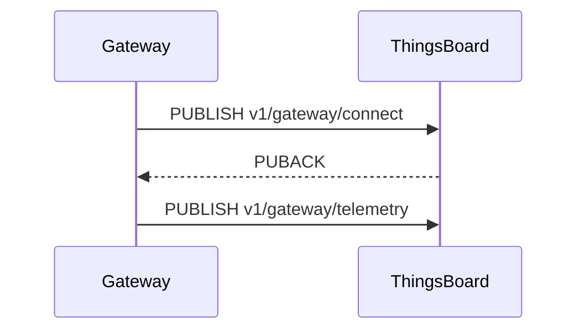

# Edit Doc

## Three-Tier Architecture

Every documentation page requires three files:

```
src/content/_includes/docs/{path}/{page}.mdx   ← ACTUAL CONTENT (shared between CE and PE)
src/content/docs/docs/{path}/{page}.mdx         ← CE stub
src/content/docs/docs/pe/{path}/{page}.mdx      ← PE stub
```

**Include file** — contains all the real content. Receives `props.product` which is passed down to `<DocLink>` and other product-aware components.

**CE stub** (minimal):
```mdx
---
title: Page Title
description: One-sentence description.
---
import PageComponent from '@includes/docs/{path}/{page}.mdx'
import { Products } from '~/models/site.models'

<PageComponent product={Products.CE}/>
```

**PE stub** — identical but `Products.PE`. Always create both stubs immediately after the include.

---

## Content Authoring Rules

### Imports (always at the top of include files)
```mdx
import DocLink from '@components/DocLink.astro';
import { Steps, Aside } from '@astrojs/starlight/components';
```
Add `Steps` only if the page has numbered procedures. Add `Aside` only if the page has callouts.

### Internal links — always use DocLink
```mdx
<DocLink product={props.product} path='user-guide/devices'>Devices</DocLink>
```
- Path: no leading slash, no trailing slash
- Never use bare markdown `[text](url)` for internal pages
- For not-yet-created pages use `path='TODO'`
- Same-page anchor links (`[text](#anchor)`) are fine in markdown

### Aside types
| Type | When to use |
|------|-------------|
| `tip` | Helpful advice or shortcuts |
| `note` | Additional, non-critical information |
| `caution` | Must know before continuing — risk of data loss or misconfiguration |
| `danger` | Destructive, irreversible action |

### Steps
- Each `<Steps>` item starts with an **imperative verb**: Click, Enter, Select, Go to, Set.
- **Combine two-part UI interactions** into one step:
  - ✅ `Enter the device name and click **Save**.`
  - ✅ `Set the trigger filter and click **Add**.`
  - ❌ Two independent actions in one step: `Configure the profile and restart the service.`
- **Show results** when an action produces a visible change: `Click **Save**. The device appears in the list.`
- Use "To + infinitive" only when context is non-obvious:
  - ✅ `To add a new device, go to **Entities > Devices**.`
  - ❌ `To save your changes, click **Save**.` (obvious — omit the context)

### Tables
Use tables for: credential types, transport options, field descriptions, protocol comparisons, parameter references. Tables are preferred over bullet lists for structured data.

### Configuration parameters
Always use ENV variable names, never `thingsboard.yml` property names.
- Wrong: `security.claim.allowClaimingByDefault`
- Right: `SECURITY_CLAIM_ALLOW_CLAIMING_BY_DEFAULT`

Look up mappings at https://thingsboard.io/docs/user-guide/install/config/ or check `MEMORY.md` for known mappings.

### Diagrams
Add an ASCII or Mermaid diagram when the topic involves a non-obvious flow: connection lifecycle, message routing, state machine, data pipeline, entity hierarchy. A diagram replaces several paragraphs of prose for these cases.

Example (Mermaid sequence):
```

```

---

## ThingsBoard Style Guide

### Core principles

Documentation must be:
- **Concise** — every word earns its place
- **Factual** — no marketing language, no hyperbole
- **Useful** — readers come to solve problems
- **Scannable** — structure matters as much as content

### Banned words and phrases

**Marketing buzzwords** — never use: powerful, robust, seamless, cutting-edge, comprehensive, out-of-the-box, next-generation

**False simplicity** — never use: easy, simple, just, straightforward

**Corporate speak** — never use: solution, leverage, enable you to, utilize

**Empty phrases** — replace with shorter alternatives:
- "in order to" → "to"
- "for example" → "like"
- "e.g." → "like"
- "such as" → "like"
- "and more" → "etc."

### Factual accuracy

Never invent: feature names, API endpoints, configuration parameters, version numbers, code syntax, or performance statistics. If you cannot verify a technical detail:
- Flag it explicitly: *"I cannot verify this claim about [X]. Please confirm."*
- Do not fill gaps with plausible-sounding information.

### Headings

**Format:** Sentence case — first word capitalized, rest lowercase except proper nouns. No period at the end.
- ✅ `Open-source IoT platform`
- ❌ `Open-Source IoT Platform`

**Length:** 5–8 words maximum.

**Depth:** H1 (one per page) → H2 (major sections) → H3 (subsections). **No H4 or deeper.**

**Introductory paragraph:** No "Overview" heading before it. Answer: what is this, what will the reader learn. No marketing language.

### Voice and tone

**Active voice by default:**
- ✅ `ThingsBoard Edge processes data locally.`
- ❌ `Data is processed locally by ThingsBoard Edge.`

Use passive voice only when the actor is unknown/irrelevant, the object matters more than the subject, or describing automatic system behavior:
- ✅ `The data is encrypted in transit.`
- ✅ `If connection is lost, messages are queued automatically.`

**Second person:** Use "you", not "the user".
- ✅ `You can configure the device profile in three steps.`
- ❌ `The user can configure the device profile in three steps.`

**No first-person plural:** Never "we recommend" or "our goal is". Use "ThingsBoard supports…" instead.

**Present tense:**
- ✅ `The device sends telemetry to the cloud.`
- ❌ `The device will send telemetry to the cloud.`

### Punctuation

**Oxford comma always:** Filter, Enrichment, and Transformation

**No em dash** — rewrite using commas, colons, or new sentences:
- ❌ `The Notification Center — accessible from the sidebar — provides tabs for…`
- ✅ `The Notification Center, accessible from the sidebar, provides tabs for…`

**Colons:** Only after a complete sentence introducing a list:
- ✅ `ThingsBoard supports three protocols: MQTT, HTTP, and CoAP.`
- ❌ `The supported protocols are: MQTT, HTTP, and CoAP.`

**Parentheses:** Only for abbreviations on first use or essential inline clarification. Not for examples.
- ✅ `Role-Based Access Control (RBAC) restricts access…`
- ❌ `The rule chain (which processes data) supports…`

### Lists

**Bulleted lists:** For unrelated items, three or more points.

**Numbered lists:** For procedures or priority order only.

**Simple enumeration (bold term + colon):**
- Capitalize items, no period at end.
- ✅ `**Delete:** Remove the Edge instance and all related data.`

**Consistency rules:**
- Parallel grammatical structure across all items.
- Maximum two levels of nesting.
- Start each item with a capital letter.
- End with a period only if the item is a complete sentence.

### Capitalization

**Always capitalize:**
- Product names: ThingsBoard Edge, Community Edition, Professional Edition
- Industry proper nouns: Docker, Java, MQTT, Kafka
- ThingsBoard **roles** when used as proper names: Tenant Administrator, Customer User, System Administrator
- ThingsBoard **entities** when used as proper names: Device, Asset, Rule Chain, Dashboard, Entity View

**Role/entity capitalization rule:**
- ✅ `The Tenant Administrator can manage all resources.` (naming the role)
- ✅ `Create a new Device in the system.` (naming the entity)
- ✅ `A tenant administrator manages resources for their organization.` (describing function, not naming)
- ✅ `Add a new device to your tenant.` (generic reference)

First instance in a sentence = UI reference or proper name (capitalize). Generic/functional reference = lowercase.

**UI elements:** Bold and capitalize when referencing directly.
- ✅ `Click **Add**.`
- ✅ `Go to **Entities > Devices**.`

**Icon-only buttons:** Use tooltip name with optional symbol.
- ✅ `Click **Add** (+).`
- ❌ `Click the "+" button.`

### Numbers

- Spell out zero through nine: `The system supports three protocols.`
- Use numerals for 10 and above: `The dashboard displays 15 sensors.`
- When different types appear together, use numerals for both: `2 gateways and 15 sensors`
- Units: space between number and unit (`100 ms`, `256 MB`), no space for percent (`50%`) or currency (`$10`)

### Examples and enumerations

Use exactly one of these three patterns:

1. **"like" + examples:** `Send commands like temperature setpoints or reboot signals.`
2. **Enumeration + "etc.":** `Supports email, SMS, Slack, Teams, etc.`
3. **Arrow chain for hierarchies:** `Building (Asset) → Floor (Asset) → Thermostat (Device)`

Never use: "for example", "e.g.", "such as", "and more", or parentheses for examples.

### Definition list format

For term/description pairs in bullet lists:

```
- **Term:** Description as a complete sentence with period.
```

- ✅ `- **Delete:** Remove the Edge instance and all related data.`
- ❌ `- **Delete** — removes the Edge instance`

---

## Sidebar Updates

The sidebar is configured in `astro.sidebar.ts`. Reference pages use `referenceItems(prefix)`, user-guide pages use `guideItems(prefix)`.

### Adding items

```ts
{
    label: 'MQTT API',
    items: [
        `${prefix}/mqtt-api/getting-connected`,
        `${prefix}/mqtt-api/telemetry`,
    ],
},
```

### ⚠ Edit tool often fails on this file

The file mixes tab depths. Use a Python replacement script instead of the Edit tool:

```python
python3 - << 'PYEOF'
with open('astro.sidebar.ts', 'r') as f:
    content = f.read()

old = "...exact string with explicit \\t chars..."
new = "...replacement..."

if old in content:
    content = content.replace(old, new, 1)
    with open('astro.sidebar.ts', 'w') as f:
        f.write(content)
    print("Done")
else:
    # Debug: show actual characters around the target line
    idx = content.find('some-anchor-string')
    print(repr(content[idx-100:idx+100]))
PYEOF
```

Always read the file first to get the exact indentation, and verify with `Read` after editing.

---

## Common Pitfalls

| Problem | Cause | Fix |
|---------|-------|-----|
| `js-yaml` parse error on frontmatter | Description contains a bare colon | Wrap value in double quotes: `description: "Foo: bar"` |
| Edit tool "String not found" in sidebar | Tab/space mismatch | Use Python script with explicit `\t` characters |
| Broken internal link | Bare markdown link used instead of `<DocLink>` | Replace with `<DocLink product={props.product} path='...'>` |
| DocLink path broken | Leading or trailing slash in path | Use `path='reference/foo/bar'` not `path='/reference/foo/bar/'` |
| Config param not found in docs | Used `thingsboard.yml` key | Look up ENV name at the config reference page |
| PE page missing | Forgot to create `pe/` mirror stub | Always create CE + PE stubs together |
| Markdown table inside JSX expression | MDX parses markdown only in angle-bracket tags | Use HTML `<table>` inside `{...}` curly-brace expressions |
| H4 heading in content | Violates "no H4 or deeper" rule | Restructure: flatten to H3 or convert to a table/list |
| Em dash in prose | Banned punctuation | Rewrite using a comma, colon, or new sentence |
| "e.g." or "for example" in text | Banned phrasing | Replace with "like" |
| Role name lowercase when naming role | Capitalization rule | "Tenant Administrator", "System Administrator" when used as proper names |
