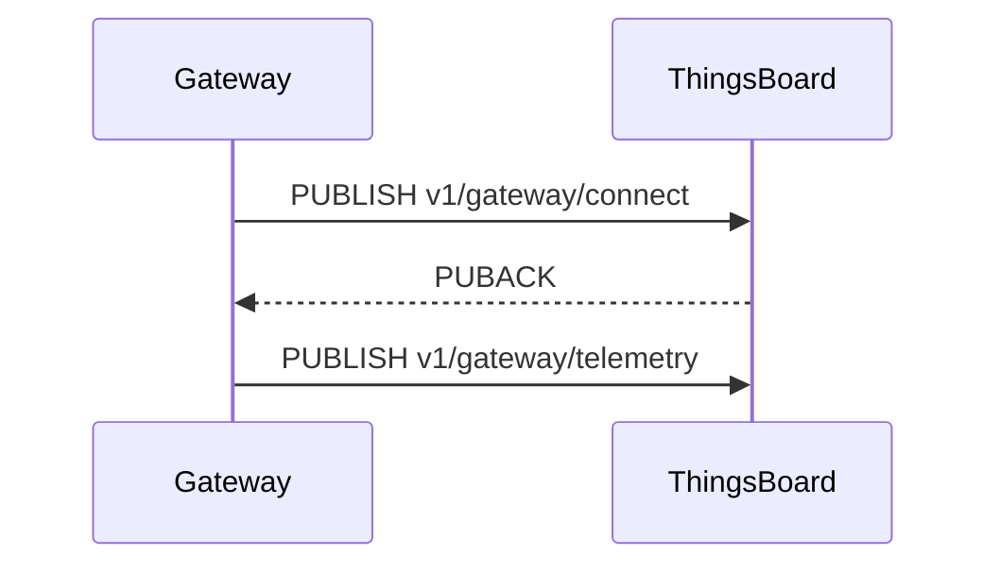

# Edit Doc

## Three-Tier Architecture

Every documentation page requires three files:

```
src/content/_includes/docs/{path}/{page}.mdx   ← ACTUAL CONTENT (shared between CE and PE)
src/content/docs/docs/{path}/{page}.mdx         ← CE stub
src/content/docs/docs/pe/{path}/{page}.mdx      ← PE stub
```

**Include file** — contains all the real content. Receives `props.product` which is passed down to `<DocLink>` and other product-aware components.

**CE stub** (minimal):
```mdx
---
title: Page Title
description: One-sentence description.
---
import PageComponent from '@includes/docs/{path}/{page}.mdx'
import { Products } from '~/models/site.models'

<PageComponent product={Products.CE}/>
```

**PE stub** — identical but `Products.PE`. Always create both stubs immediately after the include.

---

## Content Authoring Rules

### Imports (always at the top of include files)
```mdx
import DocLink from '@components/DocLink.astro';
import { Steps, Aside } from '@astrojs/starlight/components';
```
Add `Steps` only if the page has numbered procedures. Add `Aside` only if the page has callouts.

### Internal links — always use DocLink
```mdx
<DocLink product={props.product} path='user-guide/devices'>Devices</DocLink>
```
- Path: no leading slash, no trailing slash
- Never use bare markdown `[text](url)` for internal pages
- For not-yet-created pages use `path='TODO'`

### Aside types
| Type | When to use |
|------|-------------|
| `tip` | Helpful but optional guidance |
| `note` | Neutral informational context |
| `caution` | Risk of data loss or misconfiguration |
| `danger` | Destructive, irreversible action |

### Steps
Each `<Steps>` item does exactly one action. Do not combine multiple actions in a single step.

### Tables
Use tables for: credential types, transport options, topic overviews, field descriptions, protocol comparisons. Tables are preferred over bullet lists for structured data.

### Configuration parameters
Always use ENV variable names, never `thingsboard.yml` property names.
- Wrong: `security.claim.allowClaimingByDefault`
- Right: `SECURITY_CLAIM_ALLOW_CLAIMING_BY_DEFAULT`

Look up mappings at https://thingsboard.io/docs/user-guide/install/config/ or check `MEMORY.md` for known mappings.

### Writing style
- Lead with the key concept and a concrete example — no "Why use X?" sections
- Fold motivation into the intro or first example
- Simplify JSON examples — drop internal/generated fields
- API and reference tables go at the end of sections, not at the top

### Diagrams
Add an ASCII or Mermaid diagram when the topic involves a non-obvious flow: connection lifecycle, message routing, state machine, data pipeline, entity hierarchy. A diagram replaces several paragraphs of prose for these cases.

Example (Mermaid sequence):
```

```

---

## Sidebar Updates

The sidebar is configured in `astro.sidebar.ts`. Reference pages use `referenceItems(prefix)`, user-guide pages use `guideItems(prefix)`.

### Adding items

```ts
{
    label: 'MQTT API',
    items: [
        `${prefix}/mqtt-api/getting-connected`,
        `${prefix}/mqtt-api/telemetry`,
    ],
},
```

### ⚠ Edit tool often fails on this file

The file mixes tab depths. Use a Python replacement script instead of the Edit tool:

```python
python3 - << 'PYEOF'
with open('astro.sidebar.ts', 'r') as f:
    content = f.read()

old = "...exact string with explicit \\t chars..."
new = "...replacement..."

if old in content:
    content = content.replace(old, new, 1)
    with open('astro.sidebar.ts', 'w') as f:
        f.write(content)
    print("Done")
else:
    # Debug: show actual characters around the target line
    idx = content.find('some-anchor-string')
    print(repr(content[idx-100:idx+100]))
PYEOF
```

Always read the file first to get the exact indentation, and verify with `Read` after editing.

---

## Common Pitfalls

| Problem | Cause | Fix |
|---------|-------|-----|
| `js-yaml` parse error on frontmatter | Description contains a bare colon | Wrap value in double quotes: `description: "Foo: bar"` |
| Edit tool "String not found" in sidebar | Tab/space mismatch | Use Python script with explicit `\t` characters |
| Broken internal link | Bare markdown link used instead of `<DocLink>` | Replace with `<DocLink product={props.product} path='...'>` |
| DocLink path broken | Leading or trailing slash in path | Use `path='reference/foo/bar'` not `path='/reference/foo/bar/'` |
| Config param not found in docs | Used `thingsboard.yml` key | Look up ENV name at the config reference page |
| PE page missing | Forgot to create `pe/` mirror stub | Always create CE + PE stubs together |
